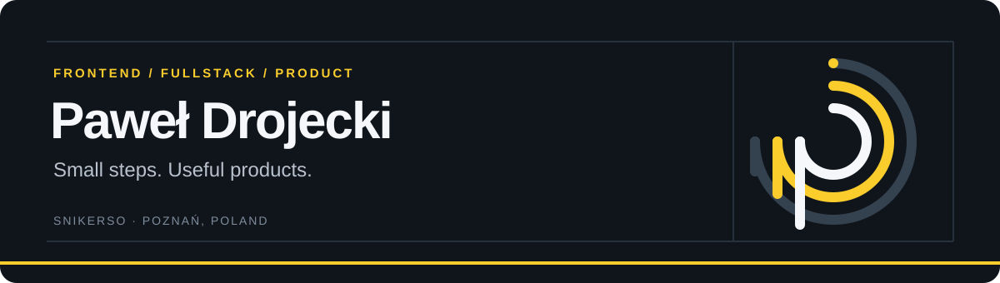

  

  <a href="https://drojecki.pro/portfolio"><strong>Portfolio & case studies ↗</strong></a>
  &nbsp; · &nbsp;
  <a href="https://www.linkedin.com/in/pawel-drojecki/">LinkedIn</a>
  &nbsp; · &nbsp;
  <a href="https://drojecki.pro/resume">Résumé</a>

---

### Hey, I'm Paweł — you might know me as Snikerso.

I build **web apps, mobile products and the backend behind them**. Based in Poznań, Poland, I work across interfaces, APIs, integrations and delivery, with a focus on React, React Native and TypeScript.

My work ranges from developing enterprise e-commerce at **The Royal Mint through NoA Ignite** to building my own products like **CleanStrategy**. I enjoy turning everyday problems into software people can actually use.

I'm curious about programming, cognitive science and how people learn. My approach is simple: **learn what the problem needs, build something useful, improve it one step at a time.**

### Selected work

| Project | What I worked on | Stack |
| :--- | :--- | :--- |
| **[The Royal Mint](https://drojecki.pro/projekty/royal-mint/)** Enterprise e-commerce · via NoA Ignite | Developing and maintaining shopping interfaces, debugging regressions and improving UI in an existing production codebase. | React · TypeScript · Azure · Auth0 |
| **[CleanStrategy](https://drojecki.pro/projekty/cleanstrategy/)** My mobile & web product | Household tasks, schedules and shared responsibilities — from product flows to the app and its backend. | React Native · Expo · Nest.js · MongoDB |
| **[Swarmcheck](https://drojecki.pro/projekty/swarmcheck/)** Argument mapping & fact-checking | Interactive argument graphs, backend endpoints and a custom role-based access control system. | React · Node.js · Express · D3.js |
| **[Moment Studio](https://drojecki.pro/projekty/moment-studio/)** Fullstack e-commerce | Storefront, product data, Stripe payments and transactional email flows. | React · Nest.js · MongoDB · Stripe · Resend |

**[Explore the full portfolio →](https://drojecki.pro/portfolio)**

### My toolkit

| Area | Technologies |
| :--- | :--- |
| **Frontend** | TypeScript, JavaScript, React, Next.js, Tailwind CSS |
| **Mobile** | React Native, Expo |
| **Backend & data** | Node.js, Nest.js, Express, MongoDB, REST APIs |
| **Integrations & delivery** | Stripe, Resend, Auth0, Azure, Google Analytics |
| **Visualization & design** | D3.js, Figma |
| **Wearables** | Garmin Connect IQ, Monkey C |

### Beyond the browser

- **[Knitting Counter Pro](https://drojecki.pro/projekty/knitting-counter-pro/)** — a Garmin watch app inspired by my girlfriend's easy-to-misplace row counter. Projects, rounds, daily goals and streaks, stored locally on the watch.
- **[Juli Jogi](https://drojecki.pro/projekty/juli-jogi/)** — a yoga platform in development, with a Next.js frontend, Nest.js backend, video lessons and a practice journal.
- **Teaching & mentoring** — I taught programming at Will Code Academy, helping beginners understand frontend development through practical work.

---

**Have a product, an app or a frontend challenge?** [Let's talk on LinkedIn.](https://www.linkedin.com/in/pawel-drojecki/)

Small steps. Useful products. Always something new to learn.

